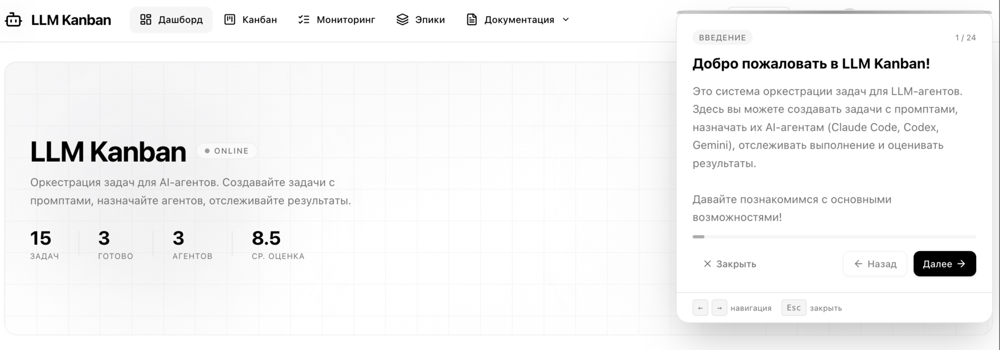

# LLM Kanban


> Kanban-доска для оркестрации задач LLM-агентов — Claude Code, Codex CLI, Gemini CLI и кастомных пайплайнов.

---

## Быстрый старт

**Requirements:** Node.js 18+

```bash
git clone https://github.com/xlurr/llm-kanban
cd llm-kanban/frontend
npm install && npm run dev
```

Открыть: [http://localhost:5173](http://localhost:5173)

| Email                   | Password   | Role      |
| ----------------------- | ---------- | --------- |
| `admin@llmkanban.ru`    | `admin123` | Admin     |
| `a.kozlov@llmkanban.ru` | `dev123`   | Developer |

---

## Главная страница


Hero-экран с агрегированной статистикой проекта в реальном времени: всего задач, завершено, активных агентов и средняя оценка выполнения. Карточки внизу показывают прогресс по завершению, динамику активности и просроченные задачи.

---

## Доска


Центральный рабочий экран. Задачи распределены по колонкам пайплайна — от Бэклога до Done. Карточка отображает эпик, теги, прогресс подзадач, дедлайн и назначенного агента. Колонка **Executing** имеет WIP-лимит (2/3) — при превышении новые задачи не принимаются. Drag-and-drop работает только по разрешённым переходам стейт-машины.

---

## Дашборд

### Аналитика


Активность за 14 дней, donut-диаграмма приоритетов, распределение задач по колонкам и гистограмма оценок ревью. Средняя оценка выполнения агентами — **8.5/10**.

---

### События и пользователи


Лента последних событий с цветовой индикацией типа (success / warning / info), топ активных пользователей с рейтингом, популярные теги и агрегированные метрики по проекту.

---

### Метрики агентов


Сравнение успешности по типам агентов: Claude Code **94%**, Codex CLI **87%**, Gemini CLI **81%**, Custom **75%**. График нагрузки по часам показывает пиковое время активности.

---

## Эпики

### Список эпиков


Эпики с прогресс-барами и цветовой разбивкой по статусам задач. Отображаются дедлайны, процент выполнения и текущий статус — Активный / Завершён / В планах.

---

### Задачи внутри эпика


Раскрытый эпик показывает привязанные задачи с текущим статусом прямо в строке — без перехода на доску. Неназначенные задачи проекта привязываются к эпику в один клик.

---

## Задачи

### Карточка задачи


Детальная страница задачи: заголовок, описание, статус, приоритет, эпик и теги в одной шапке. Ключевые метрики — время, прогресс подзадач, дедлайн и назначенный агент с его success rate — вынесены в отдельные карточки.

---

### Промпт и подзадачи


Промпт для агента отображается в отдельном блоке — именно его получает агент на выполнение. Ниже — чеклист подзадач с прогрессом и возможностью добавить новую прямо в задаче.

---

### CI/CD Пайплайн


Каждая задача может содержать CI/CD пайплайн с DAG-визуализацией стадий: Lint и Typecheck запускаются параллельно, затем Build, после — Unit Tests, E2E Tests и Security Scan параллельно, и финальный Deploy. Статус каждого рана и отдельной стадии отображается в реальном времени.

---

### Логи выполнения


Лента логов агента в реальном времени. Каждое событие имеет тип (success / warning / info) и точный таймстемп — полный трейс от старта задачи до финализации.

---

### Ревью


Авто-ревью по завершении: оценка 1–10 с визуальным индикатором, имя ревьюера, дата и текстовый комментарий. Результаты агрегируются в дашборде и профиле агента.

---

## Онбординг



Встроенный интерактивный тур из 24 шагов. Запускается автоматически при первом входе — проводит по всем ключевым экранам и объясняет концепцию prompt-first workflow.

---

## Пайплайн задачи

```
Backlog → Prompt Ready → Agent Assigned → Executing → Review → Done
                                   ↑            ↓
                                Rework ←────────┘
                                   ↓
                                Failed → Backlog
```

Все переходы настраиваются в **Board Settings → Transitions**.

---

## Стек

| Слой        | Технологии                       |
| ----------- | -------------------------------- |
| UI          | React 19, Vite 6, TypeScript 5.7 |
| Стили       | Tailwind CSS 3, shadcn/ui        |
| Стейт       | Zustand 5 + localStorage         |
| Роутинг     | React Router v7                  |
| Drag & Drop | @dnd-kit/core, @dnd-kit/sortable |
| Диаграммы   | @xyflow/react 12, Recharts 3     |

---

## Структура проекта

```
llm-kanban/
├── docs/
├── class-diagram.html
├── frontend/
│   └── src/
│       ├── app.tsx
│       ├── components/
│       │   ├── kanban-column.tsx
│       │   ├── task-card.tsx
│       │   ├── pipeline-stages.tsx
│       │   ├── transition-graph.tsx
│       │   └── ui/
│       ├── pages/
│       │   ├── board.tsx
│       │   ├── board-settings.tsx
│       │   ├── dashboard.tsx
│       │   ├── tasks.tsx / task-detail.tsx / task-create.tsx
│       │   ├── epics.tsx / epic-detail.tsx / epic-create.tsx
│       │   ├── agent-profile.tsx
│       │   └── db-diagram.tsx
│       ├── stores/
│       │   ├── tasks-store.ts
│       │   ├── agents-store.ts
│       │   ├── board-store.ts
│       │   ├── epics-store.ts
│       │   ├── users-store.ts
│       │   └── auth-store.ts
│       └── lib/
│           ├── types.ts
│           ├── mock-data.ts
│           └── utils.ts
└── resume/
```

---

## Схема данных

Полная интерактивная схема — `/diagrams` или открыть `class-diagram.html` напрямую.

| Группа        | Таблицы                                                               |
| ------------- | --------------------------------------------------------------------- |
| Core          | `tasks`, `epics`, `task_dependencies`                                 |
| Actors        | `users`, `agents`, `teams`, `team_members`                            |
| Config        | `columns`, `transitions`, `automation_rules`, `prompt_templates`      |
| Related       | `task_logs`, `subtasks`, `comments`, `reviews`, `tags`, `attachments` |
| Analytics     | `agent_metrics`, `task_events`, `cost_ledger`, `dashboard_snapshots`  |
| Security      | `api_keys`, `sessions`, `audit_log`                                   |
| Integration   | `webhooks`, `webhook_deliveries`, `notifications`                     |
| Cache / Queue | `kafka_outbox`, `job_queue`, `cache_entries`                          |

---

## Roadmap

- [ ] Go-бэкенд (микросервисы) + PostgreSQL
- [ ] Real-time обновления доски через WebSocket
- [ ] Пайплайн выполнения задач агентами (Claude / OpenAI API)
- [ ] Аутентификация (JWT) + роли Admin / Manager / Developer / Viewer
- [ ] Аналитический дашборд (cycle time, lead time, throughput)
- [ ] Cost tracking — учёт токенов и стоимости по задаче и агенту
- [ ] Automation rules — триггеры на события (auto-assign, auto-move)
- [ ] Kubernetes deployment manifests
